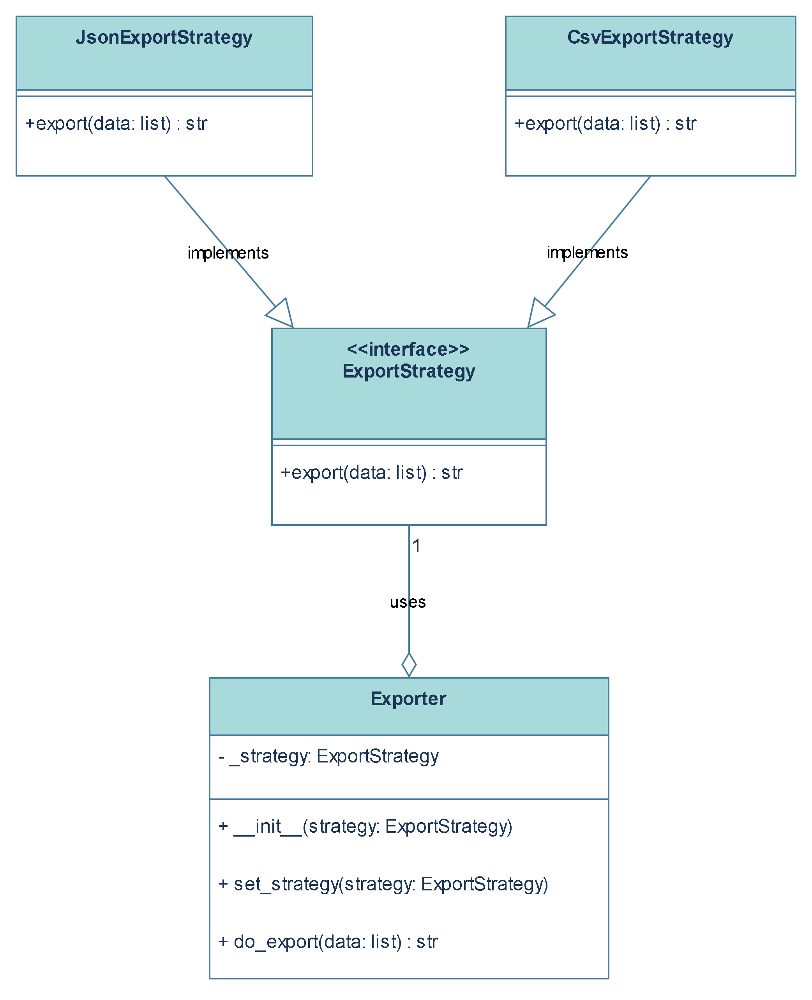

# Ejemplo de Patrón de Diseño Strategy en Python

Este proyecto es una pequeña aplicación de consola que demuestra el uso del patrón de diseño **Strategy**. La aplicación toma un conjunto de datos y los exporta en diferentes formatos (JSON y CSV).

## ¿Qué es el Patrón Strategy?

El patrón de diseño de comportamiento Strategy te permite definir una familia de algoritmos, poner cada uno de ellos en una clase separada y hacer sus objetos intercambiables. El objeto principal, llamado "Contexto", delega la ejecución del algoritmo a uno de estos objetos "Estrategia", sin saber cuál está utilizando.

## ¿Por qué aplicar el Patrón Strategy aquí?

En nuestra aplicación de ejemplo, necesitamos exportar datos a múltiples formatos. Una solución ingenua podría ser un gran método en la clase `Exporter` con una serie de condicionales (`if/elif/else`) para cada formato.

```python
# Anti-patrón: No hacer esto
class Exporter:
    def export(self, data, format):
        if format == 'json':
            # lógica para exportar a json
            pass
        elif format == 'csv':
            # lógica para exportar a csv
            pass
        # ¿Qué pasa si queremos añadir XML? ¿O YAML?
        # Tendríamos que seguir modificando esta clase.
```

Este enfoque viola el **Principio de Abierto/Cerrado** (una clase debe estar abierta a la extensión, pero cerrada a la modificación). Cada vez que quisiéramos añadir un nuevo formato, tendríamos que modificar la clase `Exporter`.

El patrón Strategy resuelve este problema de manera elegante:

1.  **Flexibilidad y Extensibilidad**: Permite añadir nuevos formatos de exportación (nuevas estrategias) sin modificar el código del `Exporter`. Simplemente creamos una nueva clase `Estrategia` que implemente la interfaz común.
2.  **Principio de Responsabilidad Única**: Cada clase de estrategia tiene una única responsabilidad: saber cómo exportar los datos en un formato específico. La clase `Exporter` solo se preocupa de orquestar la exportación, delegando los detalles a la estrategia actual.
3.  **Código más limpio**: Elimina la necesidad de sentencias condicionales complejas para seleccionar el comportamiento, haciendo el código más legible y mantenible.
4.  **Intercambio en tiempo de ejecución**: El cliente puede decidir (e incluso cambiar) qué estrategia usar en tiempo de ejecución, como se demuestra en el `main.py`.

## Diagrama de Clases

El siguiente diagrama ilustra la estructura de la solución:



## Cómo ejecutar el código

Para ver el resultado de la aplicación, simplemente ejecuta el script de Python desde la terminal:

```bash
python main.py
```